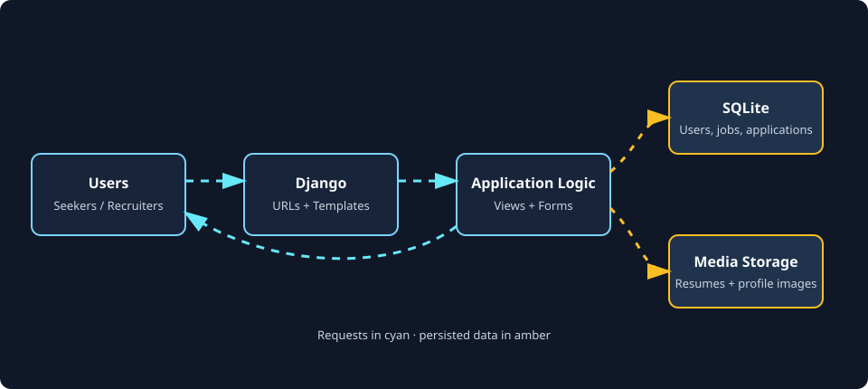

# JobConnect

## Contents

- [Description](#description)
- [Key Features](#key-features)
- [Tech Stack](#tech-stack)
- [Animated Data Flow Diagram](#animated-data-flow-diagram)
- [Getting Started](#getting-started)
  - [Prerequisites](#prerequisites)
  - [Installation](#installation)
  - [Run the Development Server](#run-the-development-server)
- [Environment Variables](#environment-variables)
- [Django Template Setup](#django-template-setup)
- [Context Data](#context-data)
- [Navigation Pages and URL Names](#navigation-pages-and-url-names)
- [Application Pages Setup](#application-pages-setup)
- [Developer Tools Setup](#developer-tools-setup)
- [Usage](#usage)
- [Related Future Functionality](#related-future-functionality)
- [License](#license)
- [Contact](#contact)

## Description

JobConnect is a Django job marketplace for connecting job seekers with recruiters. Job seekers can discover roles, compare skill matches, submit applications, and track progress; recruiters can publish vacancies and manage candidate applications from one portal.

**Audience:** job seekers, recruiters, and teams building a focused recruitment workflow with Django.

[Back to Contents](#contents)

## Key Features

- **Role-based accounts:** Register as a job seeker or recruiter with a custom Django user model.
- **Profile management:** Store seeker skills, experience, resume, location, and profile image, or recruiter company details.
- **Job publishing:** Recruiters can create jobs with categories, employment types, salary ranges, skills, and deadlines.
- **Job discovery:** Search active jobs by keyword, location, and job type with pagination.
- **Skill matching:** Calculate an overlap percentage between seeker skills and job requirements.
- **Application workflow:** Submit cover letters, withdraw applications, and advance applications through review, interview, offer, or rejection states.
- **Role-specific dashboards:** View application metrics as a seeker or job and candidate activity as a recruiter.
- **Responsive templates:** Uses Bootstrap 5 with shared Django template layout and static CSS.

[Back to Contents](#contents)

## Tech Stack

| Layer               | Technology                                                          |
| ------------------- | ------------------------------------------------------------------- |
| Backend             | Python, Django 5.2.1                                                |
| Database            | SQLite 3 (development default)                                      |
| Forms               | Django Forms, django-crispy-forms, crispy-bootstrap5                |
| Frontend            | Django Templates, Bootstrap 5.3, Font Awesome 6                     |
| Media               | Pillow                                                              |
| Configuration       | python-decouple dependency available for environment-based settings |
| Server entry points | `project/wsgi.py`, `project/asgi.py`                                |

[Back to Contents](#contents)

## Animated Data Flow Diagram

The diagram is stored as a standalone SVG so GitHub, VS Code previews, and regular browsers can render it as an image. CSS animations move the request and data lines without reducing vector quality. Open the asset directly at [docs/jobconnect-dfd.svg](docs/jobconnect-dfd.svg) to view it in a browser.



| Flow                               | Responsibility                                                                    |
| ---------------------------------- | --------------------------------------------------------------------------------- |
| User to Django                     | A browser submits authentication, profile, search, job, or application requests.  |
| Django to application logic        | Named URLs dispatch requests to views, which validate input and select templates. |
| Application logic to SQLite        | Django models persist users, profiles, jobs, and applications.                    |
| Application logic to media storage | Uploaded resumes and profile images are stored under the configured media paths.  |
| Application logic to user          | Templates render dashboards, job pages, status updates, and feedback messages.    |

[Back to Contents](#contents)

## Getting Started

### Prerequisites

- Python 3.10 or newer
- Git
- A virtual environment tool such as `venv`

### Installation

```bash
git clone https://github.com/MehediAlam49/job.git
cd job/project
python -m venv .venv
```

Activate the environment:

```bash
# Windows PowerShell
.venv\Scripts\Activate.ps1

# macOS or Linux
source .venv/bin/activate
```

Install dependencies and initialize the database:

```bash
python -m pip install --upgrade pip
python -m pip install -r requirements.txt
python manage.py migrate
python manage.py createsuperuser
```

### Run the Development Server

```bash
python manage.py runserver
```

Open `http://127.0.0.1:8000/` in a browser. The Django admin is available at `http://127.0.0.1:8000/admin/`.

For deployment, replace the development secret key, disable `DEBUG`, configure `ALLOWED_HOSTS`, and move from SQLite to a production database and persistent media storage.

[Back to Contents](#contents)

## Environment Variables

The current settings file uses development defaults directly, so no environment variable is required for a local run. For production, move secrets and deployment settings into environment variables. A compatible `.env` shape is:

```env
DJANGO_SECRET_KEY=replace-with-a-long-random-secret
DJANGO_DEBUG=False
DJANGO_ALLOWED_HOSTS=example.com,www.example.com
DATABASE_URL=sqlite:///db.sqlite3
```

Do not commit `.env` files or production credentials. If these variables are enabled in `project/settings.py`, parse comma-separated hosts before assigning `ALLOWED_HOSTS`.

[Back to Contents](#contents)

## Django Template Setup

Templates live in `project/app/templates/` and use `base.html` as the shared layout. A child template extends the base and supplies the `content` block:

```django



<section class="container py-4">
		<h1>{{ page_title }}</h1>
		
			
				<div class="alert alert-{{ message.tags }}">{{ message }}</div>
			
		
</section>

```

Static assets are loaded with Django's static tag:

```django

<link rel="stylesheet" href="">
```

Use named URLs rather than hard-coded paths:

```django
<a href="">Browse jobs</a>
<a href="">Dashboard</a>
```

[Back to Contents](#contents)

## Context Data

Views pass dictionaries to templates with `render`. For example, the home page provides active jobs and each job's parsed skill list:

```python
def home(request):
		jobs = Job.objects.filter(
				application_deadline__gte=timezone.now()
		).order_by('-created_at')[:5]
		return render(request, 'home.html', {'jobs': jobs})
```

Read context data in a template with a loop and a conditional:

```django

<article class="job-card">
		<h2>{{ job.title }}</h2>
		<p>{{ job.location }} · {{ job.get_job_type_display }}</p>
		
				<p>{{ job.skill_list|join:", " }}</p>
		
</article>

<p>No active jobs are available.</p>

```

Dashboard context includes role-specific data such as `applied_jobs`, `application_count`, `interviews_count`, `offers_count`, `jobs`, and `recent_applications`.

[Back to Contents](#contents)

## Navigation Pages and URL Names

The following named routes are defined in `project/project/urls.py`:

| Page or action            | URL name                    | Path                        |
| ------------------------- | --------------------------- | --------------------------- |
| Home                      | `home`                      | `/`                         |
| Login                     | `login`                     | `/login/`                   |
| Registration              | `register`                  | `/register/`                |
| Logout                    | `logout`                    | `/logout/`                  |
| Dashboard                 | `dashboard`                 | `/dashboard/`               |
| Profile                   | `profile`                   | `/profile/`                 |
| Update profile            | `update_profile`            | `/profile/update/`          |
| Change password           | `password_change`           | `/password_change/`         |
| Job list                  | `job_list`                  | `/jobs/`                    |
| Add job                   | `add_job`                   | `/jobs/add/`                |
| Job detail                | `job_detail`                | `/jobs/<job_id>/`           |
| Apply                     | `apply_job`                 | `/job/<job_id>/apply/`      |
| Withdraw application      | `withdraw_application`      | `/job/<job_id>/withdraw/`   |
| Update application status | `update_application_status` | `/application/<id>/`        |
| Reject application        | `reject_application`        | `/application/<id>/reject/` |
| Skill matching            | `skill_match`               | `/skillmatch/`              |
| Django admin              | `admin`                     | `/admin/`                   |

Generate links in templates with URL names and keyword arguments:

```django



```

[Back to Contents](#contents)

## Application Pages Setup

All page templates are stored in `project/app/templates/`. The shared `base.html` provides the navigation, Bootstrap assets, static stylesheet, message area, and `` used by the child pages. The sequence below follows the main user journey and identifies the implementation surface for each page.

### 1. Shared Layout: `base.html`

Use the base template as the parent for every page. Keep page-specific markup inside the `content` block and use named URLs for navigation.

```django



<main class="container py-4">
	<h1>Page title</h1>
</main>

```

### 2. Home Page: `home.html`

**Route:** `home` (`/`)  
**View:** `home`  
**Context:** `jobs` containing up to five active jobs, ordered by creation date.

The view filters out jobs whose application deadline has passed. Render the featured jobs and link each item to its detail page:

```django



<section class="container py-5">
	<h1>Find your next opportunity</h1>
	
		<a href="">
			<h2>{{ job.title }}</h2>
			<p>{{ job.location }} · {{ job.get_job_type_display }}</p>
		</a>
	
		<p>No active jobs are available.</p>
	
</section>

```

### 3. Authentication Pages: `login.html` and `signup.html`

**Routes:** `login` (`/login/`), `register` (`/register/`), and `logout` (`/logout/`)  
**Views:** `login_page`, `register_page`, and `logout_user`  
**Input:** username, email, password, password confirmation, display name, and account type.

Submit authentication forms with POST and CSRF protection:

```django
<form method="post" action="">
	
	<label for="username">Username</label>
	<input id="username" name="username" required>

	<label for="password">Password</label>
	<input id="password" name="password" type="password" required>

	<button type="submit">Sign in</button>
</form>
```

Registration uses `user_type` values `job_seeker` and `recruiter`:

```django
<select name="user_type" required>
	<option value="job_seeker">Job Seeker</option>
	<option value="recruiter">Recruiter</option>
</select>
```

After registration, the view creates the matching `SeekerProfile` or `RecruiterProfile`. After login, incomplete profiles are redirected to `update_profile`.

### 4. Profile Pages: `profile.html` and `update_profile.html`

**Routes:** `profile` (`/profile/`) and `update_profile` (`/profile/update/`)  
**Views:** `profile_view` and `update_profile`  
**Context:** `user`, `profile`, `skills`, `user_form`, and `form`.

Seekers can manage their name, phone, resume, comma-separated skills, experience, location, and profile image. Recruiters can manage company name, contact person, phone, website, location, image, and description. Profile uploads require `multipart/form-data`:

```django
<form method="post" enctype="multipart/form-data">
	
	{{ user_form.as_p }}
	{{ form.as_p }}
	<button type="submit">Update profile</button>
</form>
```

Display normalized skills as a list:

```django

	<span class="badge text-bg-primary">{{ skill }}</span>

```

### 5. Password Page: `password_change.html`

**Route:** `password_change` (`/password_change/`)  
**View:** `password_change`  
**Input:** current password, new password, and confirmation.

The view authenticates the current password, updates the password, and preserves the active session:

```django
<form method="post" action="">
	
	<input name="current_password" type="password" required>
	<input name="new_password" type="password" required>
	<input name="confirm_password" type="password" required>
	<button type="submit">Change password</button>
</form>
```

### 6. Job List Page: `joblist.html`

**Route:** `job_list` (`/jobs/`)  
**View:** `job_list`  
**Context:** `jobs`, `jobs_count`, `search_query`, `location_query`, and `job_type_query`.

The page supports keyword, location, and job type filters. Preserve filters when generating pagination links:

```django
<form method="get" action="">
	<input name="search" value="{{ search_query }}" placeholder="Search jobs">
	<input name="location" value="{{ location_query }}" placeholder="Location">
	<select name="job_type">
		<option value="">All types</option>
		<option value="full_time">Full time</option>
		<option value="remote">Remote</option>
	</select>
	<button type="submit">Search</button>
</form>


	<a href="">{{ job.title }}</a>

```

For an authenticated seeker, each job may expose `match_percentage`; recruiters see their own active jobs.

### 7. Job Detail Page: `jobdetails.html`

**Route:** `job_detail` (`/jobs/<job_id>/`)  
**View:** `job_detail`  
**Context:** `job` with a parsed `skill_list`.

Render job facts and provide the application action for an eligible seeker:

```django



<article class="container py-4">
	<h1>{{ job.title }}</h1>
	<p>{{ job.description }}</p>
	<p>{{ job.get_job_type_display }} · {{ job.location }}</p>
	<a href="">Apply now</a>
</article>

```

Only jobs with a current or future deadline are returned by the detail view.

### 8. Recruiter Job Creation Page: `add_job.html`

**Route:** `add_job` (`/jobs/add/`)  
**View:** `add_job`  
**Context:** `form` using `JobForm`.

The recruiter is assigned from `request.user`; the form should include all job fields and CSRF protection:

```django
<form method="post" action="">
	
	{{ form.as_p }}
	<button type="submit">Publish job</button>
</form>
```

Skills are entered as comma-separated text, for example `Django, Python, SQL`.

### 9. Seeker Dashboard: `seeker_dashboard.html`

**Route:** `dashboard` (`/dashboard/`) for a job seeker  
**View:** `dashboard`  
**Context:** `applied_jobs`, `application_count`, `interviews_count`, `offers_count`, and `pending_count`.

Show application metrics and status values from `Application.STATUS_CHOICES`:

```django
<p>Total applications: {{ application_count }}</p>
<p>Interviews: {{ interviews_count }}</p>


	<h2>{{ application.job.title }}</h2>
	<p>{{ application.get_status_display }}</p>

	<p>You have not applied to a job yet.</p>

```

### 10. Recruiter Dashboard: `recruiter_dashboard.html`

**Route:** `dashboard` (`/dashboard/`) for a recruiter  
**View:** `dashboard`  
**Context:** `jobs`, `active_jobs`, `recent_applications`, `job_count`, `application_count`, `interviews_count`, and `opp_count`.

Recruiters can link to job creation and application actions:

```django
<a href="">Post a job</a>


	<p>{{ application.seeker.username }}: {{ application.get_status_display }}</p>
	<form method="post" action="">
		
		<button type="submit">Advance status</button>
	</form>

```

### 11. Skill Match Page: `skillmatch.html`

**Route:** `skill_match` (`/skillmatch/`)  
**View:** `skill_match_view`  
**Context:** seeker results or recruiter jobs with annotated applications.

Seekers receive jobs with a positive skill overlap. Recruiters receive their active jobs and candidate match percentages:

```django

	<article>
		<h2>{{ job.title }}</h2>
		
			<strong>{{ job.match_percentage }}% match</strong>
		
			
				<p>{{ application.seeker.username }}: {{ application.match_percentage }}%</p>
			
		
	</article>

```

### 12. Admin Page: Django Admin

**Route:** `admin` (`/admin/`)  
**Configuration:** `project/project/urls.py` and `project/app/admin.py`.

Create an administrator and open the admin site:

```bash
cd project
python manage.py createsuperuser
python manage.py runserver
```

Use `/admin/` to manage users, profiles, jobs, and applications after the models are registered in `app/admin.py`.

[Back to Contents](#contents)

## Developer Tools Setup

The following sequence sets up the project components used by contributors and maintainers.

### 1. Install the Dependency Set

Install the pinned packages from the project requirements file:

```bash
cd project
python -m pip install -r requirements.txt
```

The important packages are Django for the server, Pillow for image fields, crispy forms for rendering, and `python-decouple` for optional environment configuration.

### 2. Register the Django Application

The app must be installed and the custom user model selected in `project/settings.py`:

```python
INSTALLED_APPS = [
	# Django contrib apps...
	'app',
]

AUTH_USER_MODEL = 'app.CustomUser'
ROOT_URLCONF = 'project.urls'
```

### 3. Define Models and Forms

Models in `app/models.py` define `CustomUser`, `SeekerProfile`, `RecruiterProfile`, `Job`, and `Application`. Model forms in `app/froms.py` provide validation and upload fields:

```python
class JobForm(forms.ModelForm):
	class Meta:
		model = Job
		fields = [
			'title', 'category', 'job_type', 'location',
			'experience_required', 'skills', 'salary_min',
			'salary_max', 'description', 'application_deadline',
		]
```

When changing a model, create and apply a migration:

```bash
python manage.py makemigrations app
python manage.py migrate
```

### 4. Connect URLs to Views

Add a named path in `project/project/urls.py`, then implement or import its view:

```python
from app.views import job_list

urlpatterns = [
	path('jobs/', job_list, name='job_list'),
]
```

Use the name in templates with `` so path changes do not require editing every link.

### 5. Configure Static and Media Files

Static CSS is served from `app/static/`. Uploaded resumes and profile images require media settings and a development URL mapping:

```python
STATIC_URL = 'static/'
MEDIA_URL = '/media/'
MEDIA_ROOT = BASE_DIR / 'media'
```

```python
from django.conf import settings
from django.conf.urls.static import static

urlpatterns += static(
	settings.MEDIA_URL,
	document_root=settings.MEDIA_ROOT,
)
```

In production, serve static and media files through a web server or object storage rather than Django's development helper.

### 6. Add Admin Registrations

Register models in `app/admin.py` to make them available to staff users:

```python
from django.contrib import admin
from .models import Application, Job

admin.site.register(Job)
admin.site.register(Application)
```

### 7. Run Checks and Tests

Run these commands from the directory containing `manage.py`:

```bash
python manage.py check
python manage.py test app
python manage.py test
```

Use `--verbosity 2` when diagnosing test discovery or migration behavior:

```bash
python manage.py test app --verbosity 2
```

### 8. Prepare a Production Configuration

Before deployment, replace the development defaults and verify the deployment checklist:

```bash
python manage.py check --deploy
python manage.py collectstatic --noinput
```

Set a secret key, disable debug mode, configure allowed hosts, use a production database, secure cookies, HTTPS, backups, and persistent media storage. Never expose the development secret key or commit credentials.

[Back to Contents](#contents)

## Usage

### Job Seeker Flow

```text
1. Open /register/ and choose Job Seeker.
2. Sign in at /login/ and complete the seeker profile.
3. Browse /jobs/ or open /skillmatch/ for matching roles.
4. Open a job, submit a cover letter, and monitor status on /dashboard/.
```

### Recruiter Flow

```text
1. Open /register/ and choose Recruiter.
2. Complete company details after signing in.
3. Create a vacancy at /jobs/add/.
4. Review candidates and advance or reject applications from /dashboard/.
```

Example request for a job search:

```text
http://127.0.0.1:8000/jobs/?search=python&location=remote&job_type=full_time
```

### Management Commands

```bash
python manage.py makemigrations
python manage.py migrate
python manage.py test
python manage.py check
```

[Back to Contents](#contents)

## Related Future Functionality

These additions would strengthen a production recruitment platform but are not currently implemented:

- Email verification, password reset, and multi-factor authentication.
- Fine-grained permissions, recruiter organization accounts, and audit logs.
- PostgreSQL, Redis caching, background jobs, and object storage for uploads.
- Full-text search, saved searches, job alerts, and configurable recommendations.
- Resume parsing, richer ranking models, and recruiter bulk actions.
- Automated tests for permissions, application transitions, uploads, and matching edge cases.
- Rate limiting, virus scanning, content moderation, privacy controls, and retention policies.
- CI/CD, structured logging, monitoring, backups, and a documented deployment configuration.

[Back to Contents](#contents)

## License

This project is licensed under the [MIT License](LICENSE).

[Back to Contents](#contents)

## Contact

**Project maintainer:** Mehedi Alam  
**Email:** [mehedialam806@gmail.com](mailto:mehedialam806@gmail.com)  
**Repository:** [github.com/MehediAlam49/job](https://github.com/MehediAlam49/job)

[Back to Contents](#contents)
